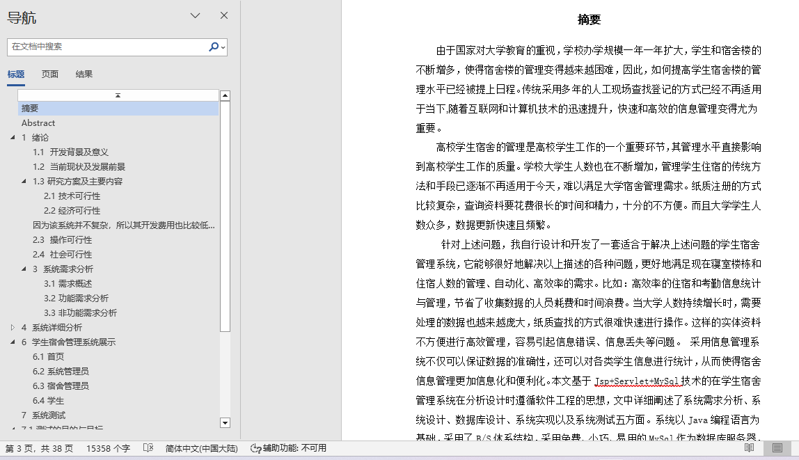
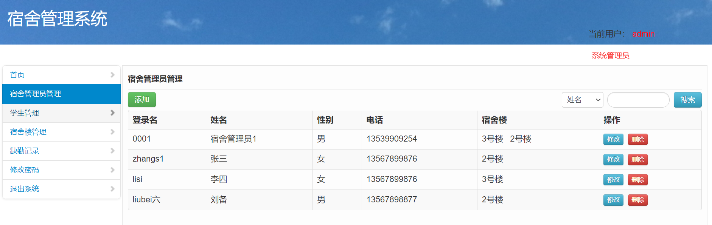
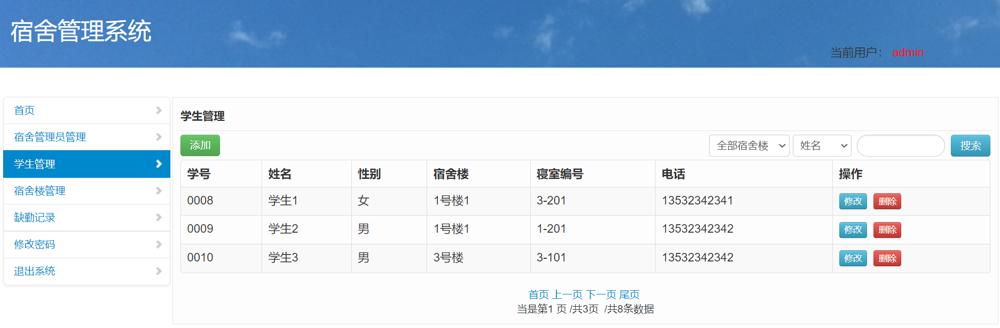
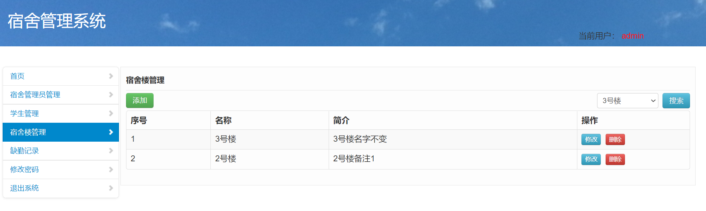
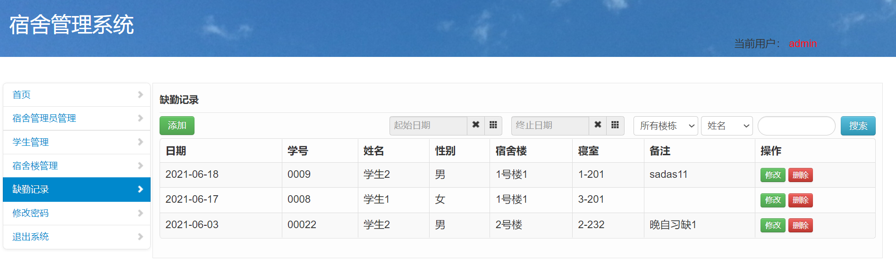
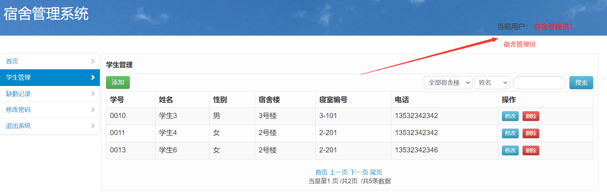

## 基于JSP+Servlet实现的学生宿舍管理系统(程序+报告)

###  获取sql数据库文件: 从戎源码网 (https://armycodes.com/) QQ: 386869957 QQ群: 377586148
###  所有系统地址: (https://github.com/YuLin-Coder/AllProjectCatalog) 
###  所有项目以及源代码本人均调试运行无问题 可支持远程安装部署调试、定制修改、代码讲解

## 项目介绍
基于JSP+Servlet实现的学生宿舍管理系统，主要功能如下
【管理员】
宿舍管理员管理；学生管理；宿舍楼管理；缺勤记录；修改密码；退出系统

【宿舍管理员】
学生管理；缺勤记录；修改密码；退出系统

【学生】
缺勒记录；修改密码；退出系统

## 项目技术
- 编程语言：Java
- 数据库：MySQL
- 前端技术：JSP、JavaScript、bootstrap、JQuery
- 后端技术：Servlet、JDBC

## 运行环境
- JDK版本：JDK1.8及以上
- 开发工具：IDEA、Ecplise、Myecplise都可以
- 数据库: MySQL5.7及以上

## 运行截图

